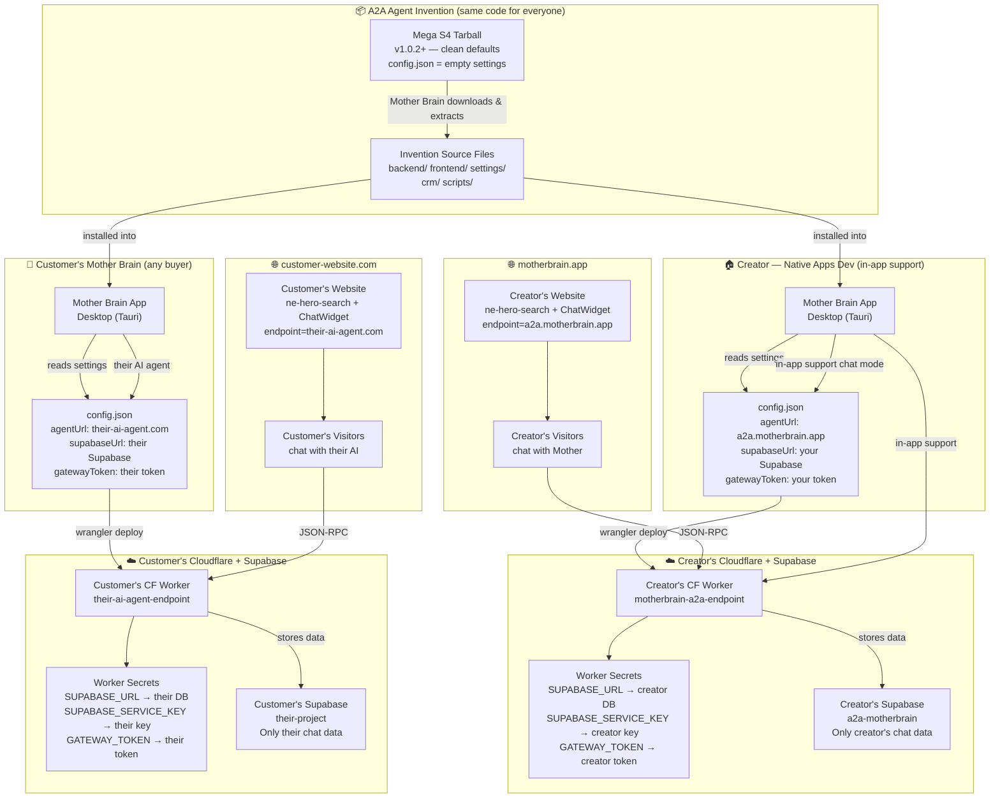

# A2A Agent Invention — Roadmap & Feature Plan

> Last updated: 2026-06-11
> Location: `~/.mother-brain/inventions/a2a-agent`  
> Repo: `https://github.com/native-apps/a2a-agent-invention`  
> Distribution: GitHub + Mega S4 (Object Storage / Bucket)

---

## Sprint 0: Ship Prep 🚀 *(current)*

### ✅ Completed
- [x] Broprint.js bundled inline (canvas + audio fingerprinting)
- [x] Gradient brain logo (green → purple, full SVG both hemispheres)
- [x] Chat history persistence (async visitor ID resolution, auto-load on connect)
- [x] Bar mode auto-show on history load + `chat-bar-show` event
- [x] Clickable 40px brain icon in bar + LED ping indicator
- [x] Split actions: `close-bar` hides, `expand` opens, `menu` dispatches event
- [x] AI Agent prompt updated with events, bar mode, FAB integration
- [x] Build → Download pipeline working
- [x] Custom events: `chat-bar-show`, `chat-bar-hide`, `chat-menu-request`, `chat-open`, `chat-close`

### ✅ Completed (since last update)
- [x] Move to own GitHub repo: `https://github.com/native-apps/a2a-agent-invention` (commit `97afc1f`)
- [x] Copy invention files to canonical location (`~/.mother-brain/inventions/a2a-agent/`)
- [x] Export A2A-related memories to new project (14 memories stored)

### ⬜ Remaining
- [x] Host on Mega S4 bucket for cloud install — v1.0.0 deployed!
  - Tarball: `https://s3.eu-amsterdam.megas4.com/motherbrain-inventions/inventions/a2a-agent/v1.0.0/a2a-agent.tar.gz`
  - Registry: `https://s3.eu-amsterdam.megas4.com/motherbrain-inventions/registry.json`
- [ ] Verify works from `~/.mother-brain/inventions/a2a-agent` (canonical location)
- [ ] Update server path resolution for canonical location
- [ ] Remove from Mother Brain source tree after verification

### Q&A — Build Widget Decisions (2026-06-16)

**Q: What does the user get when they click "Build Widget"?**
A: A ZIP file (`motherbrain-widget.zip`) containing React/TypeScript source components. Not a compiled JS bundle. The user unzips it into their project and imports the components.

**Q: Why source code instead of a compiled bundle?**
A: This is NOT a chat bubble service like Intercom. It's a tool that Mother Brain license owners use to deploy their own A2A Chat UI. Users integrate it into their React/Vite/TypeScript codebase via an IDE with an AI agent. They need source code so they can customize placement, styling, and behavior. No one just pastes a script tag.

**Q: What markdown renderer does the widget use?**
A: The custom lightweight markdown renderer (`widget-build/src/markdown.ts`). Zero dependencies. Supports bold, italic, code blocks, headers, tables, lists, blockquotes, links. Includes XSS sanitization.

**Q: What's in the ZIP?**
```
motherbrain-widget/
├── src/
│   ├── index.ts               ← Re-exports all components
│   ├── HeroSearchElement.ts   ← <ne-hero-search> web component
│   ├── ChatApp.tsx            ← React chat overlay component
│   ├── BrainIcon.tsx          ← Brain SVG logo
│   └── markdown.ts            ← Custom markdown→HTML renderer
├── package.json               ← Dependencies: react 18+ only
├── tsconfig.json
└── README.md                  ← Integration guide for AI agent
```

**Q: How does the ZIP get created?**
A: Client-side, using a minimal inline ZIP creator (STORE mode, zero dependencies). The Build Widget button fetches source files from the `/resource/` endpoint, creates the zip, and downloads it.

**Q: What was the wrong approach (deleted)?**
A: Vite library mode compiling to a single 508KB IIFE bundle (`motherbrain-widget.js`). This was a hallucinated approach — nobody wants a half-megabyte minified JS file. Deleted: `vite.config.ts`, `dist/`, `node_modules/`, `MotherbrainChatElement.tsx` (web component wrapper).

---

## Sprint 1: Knowledge Base Packing

Pack files from Mother's Knowledge Base (Obsidian vault) into the Cloudflare Worker on deploy.

### Files to Pack
| File | Path | Purpose |
|------|------|---------|
| **SOUL.md** | `~/Native Apps Dev/the-mother-brain/SOUL.md` | Mother's personality, tone, values |
| **SKILLS.md** | `~/Native Apps Dev/the-mother-brain/SKILLS.md` | Capabilities, tool reference |
| **Security.md** | `~/Native Apps Dev/the-mother-brain/Private/🔒 Mother — Internal Security Directives (PRIVATE).md` | Internal security directives |
| **Vocabulary.md** | `~/Native Apps Dev/the-mother-brain/Knowledge Base/Vocabulary.md` | Terminology reference |

### Tasks
- [ ] Evaluate CF Worker size limits (10MB paid plan)
- [ ] Build packer script into deploy flow
- [ ] Security doc handling: PRIVATE — never in client bundle or public APIs
- [ ] SOUL.md → system prompt personality injection
- [ ] SKILLS.md → tool selection accuracy
- [ ] Update mechanism: rebuild Worker when docs change
- [ ] Additional docs to consider: Pricing.md, FAQ.md

### Key Files
- `inventions/a2a-agent/backend/src/task-handler.ts` — Worker build

---

## Sprint 2: Chat UI Improvements

### ✅ Completed
- [x] **Hero Search Web Component** — Packaged in the React widget bundle (`widget-build/src/HeroSearchElement.ts`)
  - `<ne-hero-search>` registers automatically when imported
  - Dispatches `hero-search-submit` event on Enter key (bubbles, composed)
  - Pure SVG + Shadow DOM + ResizeObserver geometry preserved (Native Elements protocol)

### Tasks
- [ ] **Departure Mono font hosting** — Serve woff2 from motherbrain.app/fonts/
- [ ] **Custom logo upload + storage** — Store at `~/.mother-brain/inventions/a2a-agent/logo.*`
- [ ] **Tool call rendering investigation** — Only 2 show in Chat UI but Conversations shows many. Why?
- [ ] **Multi-agent A2A endpoint** — Sub-agent support (different personalities per worker)

### Key Files
- `widget-build/src/ChatApp.tsx` — React chat overlay component
- `widget-build/src/ChatWidget.tsx` — Drop-in widget (hero + bar + overlay)

---

## Sprint 3: CRM + Entities

Full CRM with visitor/user/agent profiles.

### Entity Types
| Type | Description | Key Fields |
|------|-------------|------------|
| **Visitors** | Anonymous via Broprint.js fingerprint | Visitor ID, message count, geo, dates |
| **Users** | Paid license holders | License status, conversion tracking |
| **AI Agents** | ChatGPT, Perplexity, etc. via A2A | Platform, capabilities, history |

### Tasks
- [ ] Entities screen component
- [ ] Visitor profile cards (fingerprint, messages, dates)
- [ ] User profiles with license tracking
- [ ] AI Agent profiles (platform, capabilities)
- [ ] Visitor-to-user conversion tracking (retain chat history)
- [ ] `@mention` visitor ID in Chat Panel
- [ ] Custom entity fields via Supabase schema additions

### Key Files
- `inventions/a2a-agent/crm/` — CRM views
- `inventions/a2a-agent/settings/` — Entity management UI

---

## Sprint 4: Website Indexing

### Tasks
- [ ] **Firecrawl integration** — Crawl website, build URL + page content index
- [ ] **Cheerio alternative** — User chooses crawler
- [ ] **Storage format** — Markdown files bundled into Worker
- [ ] **Website navigation by Mother** — Auto-navigate pages during conversations
- [ ] **MCP Server in Chat UI** — Mother controls website navigation

### Open Questions
- Can the Web Component navigate between website pages?
- Worker bundle size impact of indexed content?
- Update frequency for indexed pages?

### Experimental Idea
- What if we registered a new MCP Tool in Mother Brain's core that is extendable?
  - This could allow an AI Agent to use this tool to "talk" to Mother on the website, and she has full access to the website's MCP Server Tools that enables her to read/write pages and content.
  - Is this possible to route an MCP Tool to the A2A Agent where a request with and access/auth token can instruct Mother to update the content and documentation on the website?
    - Theory: Mother (our A2A Agent) has an Obsidian Vault for her Knowledge Base, and it's loaded in as a project in Mother Brain. If we update or create a new document, then is it possible to give the AI Model running in Obsidian Smart Composer a A2A-Tool that can perform a `TASK` via the A2A Endpoint to Mother, that will instruct her to use the website's MCP Tools to edit/remove/create content on the website, or perform other backend functions?

- See response: `docs/Experimental-A2A-Tool-for-MB-MCP.md`

---

## Sprint 5: Multi-Agent + Advanced

### Tasks
- [ ] Sub-Agent support (multiple AI personalities from one Mother Brain)
- [ ] Sub-Agent management UI (create, edit, delete, assign)
- [ ] Different system prompts, skills, knowledge per Sub-Agent
- [ ] Same Worker with different skill routing, or separate Workers

---

## Sprint 6: Invention Registry + Distribution

### Tasks
- [ ] Invention Uploader UI (accept zip/tar.gz in Inventions screen)
- [ ] Public registry on motherbrain.app (plugin marketplace)
- [ ] One-click install + auto-updates from registry
- [ ] GitHub repo URL install method
- [ ] Cerebellum recipe integration (`/mother setup A2A Agent` guided wizard)

---

## Bugs — Critical 🔴

| # | Bug | Severity | Status |
|---|-----|----------|--------|
| 1 | **Brainstorm mode adding random projects** — When enabled, random projects get linked that the user didn't select. A2A Agent tool calls showed queries from unrelated projects. | 🔴 Critical (security) | Unresolved |
| 2 | **Tool calls discrepancy** — Only 2 tool calls show in Chat UI but Conversations screen shows many. Likely: Chat UI only renders tool calls on the final agent message, Conversations shows all intermediate steps. | 🟡 Medium | Investigating |
| 3 | **MCP Tool security audit** — Need to verify only approved/restricted tools are exposed in the CF Worker A2A endpoint. | 🔴 Critical | Pending review |

---

## Security Tasks 🔒

| Task | Notes |
|------|-------|
| Brainstorm mode project isolation | Only user-selected projects accessible to any agent |
| A2A MCP tool whitelist audit | Verify only approved tools exposed in CF Worker |
| Rate limiting review | Prevent abuse of A2A endpoint |
| Security doc packing | PRIVATE handling — never in client-side code |
| Visitor ID integrity | Broprint.js must produce identical hashes to website |

---

## Invention Protocol — How Mother Brain Loads Extensions

### Canonical Location
```
~/.mother-brain/inventions/a2a-agent/
```

### Required Structure
```
a2a-agent/
├── config.json              ← Invention metadata + settings (required)
├── README.md                ← Documentation
├── ROADMAP.md               ← This file
├── backend/
│   ├── src/
│   │   └── task-handler.ts  ← Cloudflare Worker source
│   └── schema/
│       ├── 001_initial.sql
│       ├── 002_visitor_sessions.sql
│       ├── 003_visitor_total_recall.sql
│       └── 004_realtime.sql
├── widget-build/
│   └── src/                     ← React widget source (the deployable bundle)
├── settings/
│   ├── A2aAgentSettings.tsx     ← Settings panel (registered in InventionsView)
│   ├── A2aChatPreview.tsx
│   └── A2aReadme.tsx
├── crm/
│   └── A2aCrmView.tsx
├── standalone/
│   ├── A2aStandalone.tsx
│   └── InventionStandalone.tsx
└── recipes/
    ├── a2a-setup.md
    └── a2a-widget-deploy.md
```

### config.json Schema
```typescript
interface InventionConfig {
  id: string;                    // "a2a-agent"
  name: string;                  // "A2A Agent"
  description: string;
  type: InventionType;           // "a2a-agent" | "data-primer" | etc.
  version: string;
  enabled: boolean;
  installedAt: string;           // ISO date
  updatedAt: string;             // ISO date
  projectIds: string[];          // Empty = global, specific = scoped
  settings: Record<string, any>; // Invention-specific flexible JSON
  database?: {
    provider: "sqlite" | "supabase" | "embedded-pg";
    collection?: string;
  };
  tools?: string[];              // MCP tools this invention registers
  routes?: string[];             // API routes this invention adds
  icon?: string;                 // lucide-react icon name
  author?: string;
  homepage?: string;
}
```

### Settings Component Registration
The settings component is registered in `InventionsView.tsx`:
```typescript
const INVENTION_SETTINGS_REGISTRY = {
  "a2a-agent": A2aAgentSettings,
};
```
The registry maps `config.type` → a React component that receives `{ invention, onUpdate }`.

### Server API Routes
- `GET /api/inventions` — List all inventions
- `GET /api/inventions/:id` — Get invention config
- `POST /api/inventions` — Create invention from template
- `PATCH /api/inventions/:id` — Update invention settings
- `DELETE /api/inventions/:id` — Delete invention
### Inventions Store
All CRUD operations are in `lib/inventions-store.ts`. It reads/writes `config.json` from `~/.mother-brain/inventions/{id}/config.json`.

---

## Custom Events (dispatched by the Web Component)

| Event | When | Detail | Used by |
|-------|------|--------|---------|
| `chat-bar-show` | History loads & bar auto-shows, or minimize | `{ lastMessage: string \| null }` | Host site hides its FAB |
| `chat-bar-hide` | X button on bar clicked | — | Host site shows FAB again |
| `chat-menu-request` | Brain icon clicked in bar | — | Host site opens navigation |
| `chat-open` | Expand ↗ clicked | — | Host site hides FAB |
| `chat-close` | Chat overlay closed | — | Host site shows FAB |
| `message-sent` | User sends a message | `{ text }` | Analytics/tracking |
| `message-received` | Agent responds | `{ text }` | Analytics/tracking |

---

## Key Files Quick Reference

| File | Purpose |
|------|---------|
| `widget-build/src/ChatWidget.tsx` | Drop-in React widget (hero + bar + overlay) |
| `widget-build/src/visitor-identity.ts` | Broprint.js visitor fingerprinting + stale key cleanup |
| `settings/A2aAgentSettings.tsx` | Settings panel UI (deploy, widget build, CRM) |
| `backend/src/task-handler.ts` | Cloudflare Worker (A2A protocol handler) |
| `backend/schema/` | Supabase SQL migrations (4 files) |
| `lib/inventions-store.ts` | Mother Brain plugin loading system |

---

## Architecture: Creator vs Customer Isolation

The A2A Agent invention is the **same code** for everyone. Isolation between the creator's (Native Apps Dev) in-app support chat and customer deployments happens at the **configuration and infrastructure layer**, not the code layer.



### Isolation Points

The two stacks (creator vs customer) **never share data or infrastructure**. The invention code is just the engine — the configuration, secrets, and databases are completely separate per user.

| Layer | Creator (Native Apps Dev) | Customer (any buyer) |
|-------|-------------------------|----------------------|
| **Invention code** | Same tarball from Mega S4 | Same tarball from Mega S4 |
| **Config.json** | Creator's settings at `~/.mother-brain/inventions/a2a-agent/` | Customer's settings at `~/.mother-brain/inventions/a2a-agent/` |
| **CF Worker** | Creator's Cloudflare account, creator's secrets | Customer's Cloudflare account, customer's secrets |
| **Supabase** | Creator's project, creator's data | Customer's project, customer's data |
| **Website** | motherbrain.app → creator's endpoint | their-site.com → customer's endpoint |
| **Chat data** | Lives in creator's Supabase only | Lives in customer's Supabase only |
| **Gateway** | Creator's MCP Gateway + token | Customer's own Gateway (or none) |
| **System prompts** | "You are Mother..." (set in Settings) | "You are their agent..." (set in Settings) |

### How the Creator's In-App Support Works

1. Mother Brain app has an in-app support chat mode
2. This chat mode reads the A2A Agent invention's settings from `config.json`
3. The settings point to `a2a.motherbrain.app` (the creator's CF Worker)
4. The CF Worker has the creator's Supabase + Gateway secrets
5. Chat data flows: In-app → Creator's CF Worker → Creator's Supabase
6. **Customer's in-app chat goes through THEIR config, not the creator's**

### Security: What Ships in the Tarball (v1.0.2+)

The deploy script (`deploy-to-mega.cjs`) packages `config.json` with **empty settings** — no URLs, keys, or tokens. The creator's real config is saved and restored locally after packaging.

The MB app's update handler should **deep-merge** the new config with the existing one:
- Keep: user's `settings` (agentUrl, supabaseUrl, keys, etc.)
- Update: structural fields (version, components, routes, tools, description)
