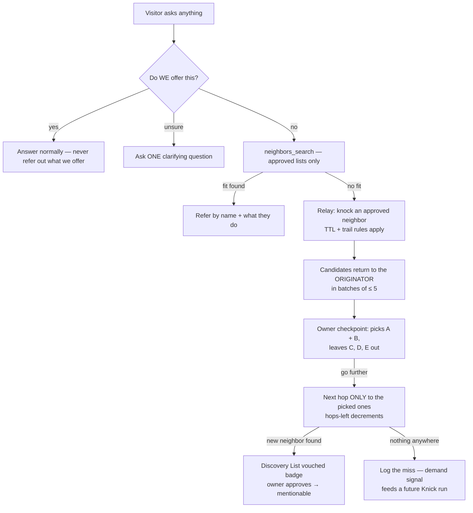

# SOP Doctrine & Relays — the Neighbor Referral System

**Status:** DESIGN BLUEPRINT — owner decisions logged 2026-08-30 (§10).
**Purpose:** This file is the single source of truth for the referral/relay
feature: the core doctrine, the owner dials, the discovery landing path, Knick
integration prep, phasing, and the running Q&A / decision log. Every change to
this feature gets reflected here first.

**Owner's framing (north star):**
> "A friend of a friend knows another friend, and they got back to me and said
> yes, they can help you — just like how humans already do naturally."

---

## 1. The vision (the funnel)

A visitor — human OR agent — asks anything in natural language. No magic words
("neighbors", "do you know someone…") are ever required.



**Three laws:**
1. **Ours first.** Never refer a visitor out for something we offer.
2. **Never leave a need unanswered.** If we don't offer it, search the neighbors.
3. **New neighbors belong to the owner.** Relay discoveries are *proposals*,
   never auto-approved, never mentionable until the owner tags them in.

---

## 2. What exists today (the map)

| Piece | Where | State |
|---|---|---|
| Ours-first triage (visitor chats AND knocks) | `NEIGHBOR_TRIAGE_BLOCK` — `backend/src/knowledge-base.ts` | ✅ live, every conversation |
| `neighbors_search` (approved-only default, competitor guard) + `neighbors_knock` | `backend/src/neighbor.ts` local tools | ✅ live |
| Owner SOPs (Markdown playbooks, AI generate, toggles) | CRM SOPs tab → `AGENT_NEIGHBOR_SOPS_JSON` → `getNeighborB2BBlock` | ✅ live (B2B conversations only) |
| Autonomy levels L1/L2/L3 (deal mandates) | `getNeighborB2BBlock` | ✅ live |
| Typed knocks (static handler, no LLM on receive) | `knick-notify` pattern, `neighbor.ts` | ✅ live |
| Discovery pool (discovered ≠ approved) | CRM `prefs.discovered` + Knick engine `crm/knick.ts` | ✅ live |
| Approved-only mentions (v1.2.211 hard rule) | triage block + `neighbors_search` data layer | ✅ live |

**Gaps this blueprint closes:**
- No relay etiquette (how to ASK, how to ANSWER, loop/TTL rules).
- No landing path for "friend of a friend" discoveries (they die in the thread).
- No owner dials (depth, fan-out, batches).
- No demand capture when nothing fits anywhere.

---

## 3. Layer 1 — The Core Doctrine (baked-in, always on, NOT owner-editable)

Extends `NEIGHBOR_TRIAGE_BLOCK` + `getNeighborB2BBlock`. Shipped in the worker;
every deployed agent adopts it on redeploy — the convention **self-propagates**
across the network with zero protocol changes and degrades gracefully against
older agents.

### The Relay Envelope

Every relay knock carries a compact, human-AND-machine readable header in its
message text:

```
[relay] need: <one line — what the visitor wants>
from: originator.tld
trail: originator.tld > partner-b.tld
hops-left: 1
batch-cap: 5
```

### The rules (draft prompt wording)

**When you cannot help (visitor or agent):**
- R0 — Triage first (existing triage block, unchanged).
- R1 — Search approved neighbors (`neighbors_search`, default scope) before any
  knock. A search hit needs no relay — refer directly.
- R2 — Relay only when the approved list has no fit. Knock at most your
  fan-out dial approved neighbors with ONE clear question.
- R3 — **Never contact or suggest anyone already in the `trail`** — the
  originator included. (This is the loop-back guard: agent C must never refer
  the creator of the request back by mistake.)
- R4 — **TTL:** forward only while `hops-left > 0`; decrement on every forward.
  At 0, answer from your own knowledge + approved lists only. Never exceed the
  originator's budget.
- R5 — **Return, don't hoard:** all discovered names flow back upstream to the
  ORIGINATOR, which aggregates + dedupes. Intermediate agents may forward
  within TTL, but results always return.
- R6 — **Batches:** return candidate discoveries in batches of ≤ 5
  (`batch-cap`). The originator's owner picks which ones (if any) continue.

**When you RECEIVE a relay ask (every agent gets this doctrine):**
- A1 — State plainly whether you offer what's asked. No hedging.
- A2 — Name up to 3 of YOUR approved neighbors who plausibly offer it. Never
  name unapproved neighbors, competitors, or anyone in the trail.
- A3 — Append yourself to the trail, decrement `hops-left`, return the answer
  upstream. Do not contact anyone new unless you are the originator running a
  checkpoint-approved next hop.
- A4 — You do NOT add discovered names to your own lists. Relay discoveries are
  proposals for owners, always (symmetric for every agent in the chain).

**Always:**
- T1 — Nothing fits anywhere → say so plainly to the asker; never fabricate a
  referral. Log the miss (demand signal, §6).
- T2 — Cost manners: one question per knock, no follow-up spam, never relay
  the same need to the same neighbor within 24h.

### Visitor chats vs agent knocks (important nuance)

- **Visitor chats:** at most ONE synchronous knock mid-conversation ("asking
  around — one moment"); deeper relays are async/owner-checkpointed because a
  website visitor won't wait minutes.
- **Agent knocks (A2A threads):** full relay machinery — the thread persists,
  so async checkpoints and multi-hop payoffs land naturally.

---

## 4. Layer 2 — Owner dials (the SOP layer)

Owners control HOW their agent relays, always inside the doctrine. Two parts:

### 4a. Structured dials (safe settings UI, not freeform)

Lives in the CRM **SOPs tab** as a "Relay" block. Deployed with the agent like
the other neighbor settings.

| Dial | Default | Range | Meaning |
|---|---|---|---|
| `relayEnabled` | on | on/off | Master switch for outbound relays |
| `relayMaxHops` | 2 | 1–3 | TTL the originator stamps on relay envelopes (network hard ceiling 3) |
| `relayFanout` | 1 | 1–2 | Concurrent neighbors knocked per hop (serial by default — anti-chain-reaction) |
| `relayBatch` | 5 | 1–5 | Max new-neighbor candidates per checkpoint (the owner's 1–5 idea) |
| `relayMode` | checkpoint | checkpoint | **checkpoint** = agent stops and the owner picks the next batch. *(autonomous reserved for a future phase, possibly gated at autonomy L3)* |

**The checkpoint flow (owner-paced discovery):**
1. A relay returns ≤ 5 new-neighbor candidates to the ORIGINATOR.
2. Agent stops. Owner sees: "Found 5 candidates — interested in A and B?"
3. Owner picks (e.g. A + B in; C, D, E out). Next hop goes ONLY to the picked.
4. Repeat while `hops-left > 0` and the owner wants more.

This turns an unbounded chain reaction into an owner-paced loop — **the**
anti-haywire valve.

### 4b. The Relay SOP (Markdown, editable, AI-generatable)

Same system as the existing SOPs: Markdown body, enable toggle, **AI generate**
button (identical pattern to SOPs/Goals/Deals AI generate), editable by hand.
It styles the etiquette: how asks are phrased, attribution wording, what to
include with a referral, how to say "nothing fits".

**New SOP field — `scope`:** `neighbor` (B2B conversations — current behavior,
default for existing SOPs) | `all` (visitor chats too). The default Relay SOP
template ships with `scope: all` because the referral moment is usually
visitor-facing. *(B2B is today's focus; the field keeps the door open for
future non-B2B agents — matchmaking, communities, whatever comes.)*

---

## 5. Layer 3 — Discovery landing path (the payoff)

New-neighbor candidates found via relay land in the SAME **Discovery List** the
NEIGHBORS DISCOVERY screen already shows.

**Data flow (implementation path):**
1. Worker logs a relay event (candidates + vouch source) to a new
   `relay_events` table (new numbered `backend/schema/` file — the existing
   provision/migration system applies it automatically on every project).
2. CRM NeighborsView pulls relay events on open and merges candidates into
   `prefs.discovered` with:
   - source `relay`, reason `vouched by {domain}`
   - `matchedGoals` = the original ask (truncated)
3. Discovery List rows render a `vouched by …` badge; the existing actions
   (tag into a list / add to My Network / dismiss) apply unchanged.
4. **v1.2.211 preserved:** relay discoveries are never mentionable by the
   agent until the owner tags them into a published list.

*(Future opt-in to discuss: "vouched mentions" — agent may name a
relay-discovered neighbor WITH attribution, e.g. "our partner B recommends C".
Off by default; needs its own decision.)*

---

## 6. Layer 4 — Knick fallback (prepare now, hire later)

**Now (Phase 2):** when nothing fits anywhere, the worker logs the miss
(`relay_events`, kind `miss`: question + extracted need + timestamp). The CRM
shows a **"Missed asks"** feed with two actions:
- **Run Knick with this** — prefills the Knick prompt with the need and runs
- **Add as Goal** — creates a paused goal for the owner to review

Demand feeds discovery — no costly in-band crawls.

**Later:** Knick lives on market.near.ai as a paid agent with an enriched
database. The integration point is exactly this demand feed + a **Hire Knick**
action. Payment model (marketplace account vs direct $NEAR vs escrow) is an
open question — stored in memory, to be decided when Knick is built.

---

## 7. Containment summary (anti-haywire checklist)

| Risk | Control |
|---|---|
| Infinite relay loops | TTL ≤ 3 (originator-stamped, decrements) |
| A→B→C→A back-referral | Full trail in every envelope; never contact/suggest anyone in it |
| Exponential fan-out | Serial default (fan-out 1; dial max 2) |
| Chain reaction through unknowns | Batches ≤ 5 + owner checkpoint before any next hop |
| Agent going rogue approving neighbors | No auto-approval, ever — discoveries are proposals only |
| Spam | 24h per-neighbor dedupe, one question per knock |
| Cost blowout | Originator aggregates; intermediate hops return instead of spraying; bounded by TTL × fan-out |
| Visitor patience | 1 synchronous knock max in visitor chats; deeper relays async |

---

## 8. Phasing

- **Phase 1 — ✅ BUILT (2026-08-30, pending ship):** Layer 1 doctrine block
  (`NEIGHBOR_RELAY_DOCTRINE_BLOCK` — envelope, trail, TTL, answer etiquette,
  visitor nuance) + relay dials (`AGENT_RELAY_SETTINGS_JSON` →
  `setRelaySettings`, clamped worker-side) + CRM Relay dials panel (SOPs tab) +
  SOP `scope` field (neighbor | all; scope-all SOPs inject into every
  conversation; B2B-scoped stay in the B2B block) + **＋ Relay SOP** template
  button (scope: all). No `relay_events` yet — candidates surface in the
  conversation itself; Phase 2 gives them the Discovery List landing.
- **Phase 2 — ✅ BUILT (2026-08-30, shipped in v1.2.255):** `relay_events`
  table (schema 017 — no embedding column, never touches VoyageAI) +
  `relay_report` local tool (candidates ≤ 5 / miss) + `[relay]` knock auto-log
  (kind "ask" audit trail) + CRM `syncRelayEvents` merge into the Discovery
  List (🤝 vouched-by badges; respects dismissals; never auto-approved) +
  📭 **Missed asks** panel (🔭 Run Knick prefills the prompt · 🎯 Add as Goal
  creates a paused goal). Projects need one Provision and Push to create the
  table; the CRM fail-opens silently until then.
- **Phase 3 (later):** autonomous relay mode (maybe L3-gated), typed
  `referral-request` RPC knock (machine-parseable, cheaper), in-band Knick
  integration.

---

## 9. Open questions

1. Autonomous relay mode — ever? Gate at autonomy L3?
2. Vouched mentions with attribution — opt-in flag? (§5)
3. Async relay resolves for website visitors — no contact channel; is the CRM
   notification enough (owner follows up manually)?
4. `relay_events` schema file number + migration timing (next sequential file
   after the current 016).
5. Exact placement of the Relay dials UI in the SOPs tab (mock before build).
6. Future: embed the AI Assistant into the Neighbors screen (like the Wizard)
   — owner explicitly deferred ("wait until we really need it").

---

## 10. Decision log (Q&A) — this file is the channel for this feature

**2026-08-30 — owner decisions:**
1. **Build both Layer 1 + Layer 2** — doctrine is a must; owners get dials
   within it. Layer 2 = structured dials + a Markdown SOP with AI generate.
2. **Mid-conversation knocking** — owner accepted the recommendation:
   refer + offer to ask around, 1 knock max, depth 2 default; PLUS the
   checkpoint refinement — agents return batches and WAIT for the owner's
   picks ("interested in A and B, leaving C, D, E out").
3. **New-neighbor payoff** — relay discoveries land in the SAME Discovery
   List (NEIGHBORS DISCOVERY screen); owner approves → mentionable.
4. **SOP scope** — B2B focus today, but the scope field is flexible for
   future non-B2B agents.
5. **Knick** — not built yet (paid, market.near.ai, enriched DB). Design the
   demand feed now; integrate fully when he ships.
6. **Relay core rules** — originator never loops back (trail rule confirmed);
   owners control how far requests relay; prevent runaway chain reactions.
