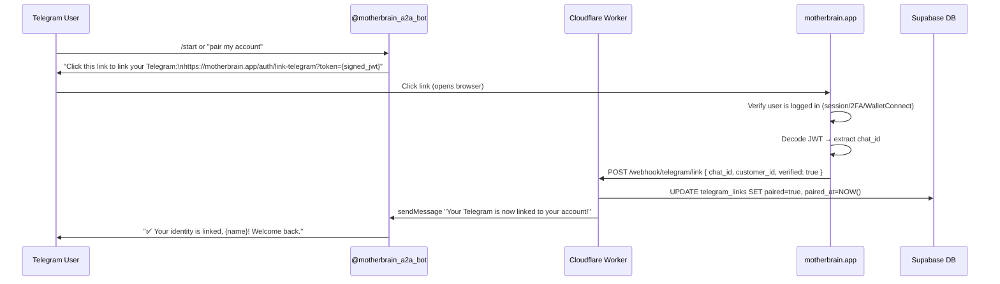
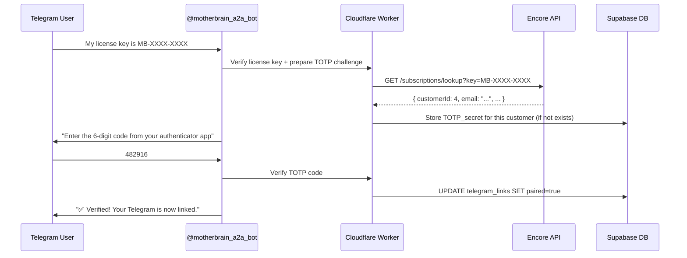

# Telegram Identity Pairing & Multi-Platform Chat Unification

**Created:** July 24, 2026
**Status:** Design Document — Implementation Not Started
**Related:** `backend/src/telegram.ts`, `backend/schema/011_telegram_links.sql`

---

## Overview

The A2A Agent (@motherbrain_a2a_bot) can currently respond to anyone who DMs it on Telegram. However, all Telegram users are currently **anonymous visitors** — they have no link to their customer account, license, or website chat history.

This document outlines the approach for:
1. **Identity verification** — How Telegram users prove they own a license & claim their identity
2. **Chat history unification** — Merging Telegram, website, and in-app support conversations
3. **Group channel behavior** — How Mother behaves in @motherbrain_app public channel
4. **Backloading history** — Showing previous conversations in Telegram

---

## Current State

### What's Already Built

| Feature | Status |
|---------|--------|
| Telegram webhook handler (`telegram.ts`) | ✅ Deployed |
| Bot responds to private DMs | ✅ Working |
| Text-only processing (security: skips media) | ✅ Working |
| Tasks stored in Supabase (same DB as website) | ✅ Working |
| Entity tracking (source: "telegram") | ✅ Working |
| `telegram_links` table (schema 011) | ✅ Schema exists, NOT deployed to Supabase |
| Identity pairing flow | ❌ Not implemented |
| Group/channel support | ❌ Blocked (filters `!private`) |
| Chat history unification | ❌ Not implemented |
| Welcome/onboarding flow | ❌ Not implemented |

### Current Data Flow

```
Telegram User → @motherbrain_a2a_bot
  → POST /webhook/telegram (Cloudflare Worker)
  → visitor_id = "telegram:{chatId}"
  → handleTaskMessage() (Gateway → AI → MCP tools)
  → Supabase (tasks + task_messages)
  → sendMessage() back to Telegram
```

All Telegram users are **anonymous** — `customer_id = null` in the task record.

---

## Identity Verification Options

### Option 1 (RECOMMENDED — Primary): One-Time Verification Link

The most secure and user-friendly approach. Reuses the existing website authentication stack.

**Flow:**



**Security:**
- JWT is short-lived (5 min), signed with JWT_SECRET
- Embed chat_id in token so it can't be replayed for a different chat
- Website verifies user session before accepting the link
- No secrets transmitted over Telegram chat

**Implementation Requirements:**
- Website side: New route `/auth/link-telegram` that accepts token, verifies JWT, calls Worker
- Worker side: New endpoint `POST /webhook/telegram/link`
- Worker side: Generate signed JWT containing `{ chat_id: number, exp: now+5min }`
- JWT_SECRET already shared between website and Worker ✅

---

### Option 2 (RECOMMENDED — Fallback): License Key + TOTP

Works entirely within Telegram — no browser needed. Use for users who can't/won't click a link.

**Flow:**



**Security:**
- License key alone is NOT sufficient for pairing
- Requires second factor: TOTP (authenticator app) or email verification
- Rate-limit: max 3 attempts per chat_id, then 1-hour cooldown
- TOTP secret is stored server-side, linked to the customer account

**Implementation Requirements:**
- TOTP generation/verification utility (use `otplib` or manual HMAC-SHA1)
- Store `totp_secret` in Supabase customer record (or telegram_links)
- Encore API lookup already works ✅

---

### Option 3: QR Code Image Upload (Deferred)

**NOT RECOMMENDED for v1.** Requires image processing in the Worker, which adds complexity.

**Why it's complex:**
- Telegram bot API delivers images via `file_id` → requires `getFile` → `file_path` → download
- Current code SKIPS all media (security feature)
- Would need to add image parsing, QR decoding, and trust the QR pairing flow
- QR codes expire, adding UX friction

**Revisit if:**
- Users explicitly request it
- Image processing in Workers becomes trivially easy

---

### Option 4: Email Verification Code (Alternative Fallback)

If user doesn't have TOTP set up, Mother can send a verification code to the user's registered email.

**Flow:**
1. User sends license key
2. Mother looks up email from Encore API
3. Mother generates 6-digit code, sends via email (via Encore or SendGrid API)
4. User types code back in Telegram
5. On success → link established

**Requires:** Email API integration (or existing Encore email endpoint).

---

## Chat History Unification

### How It Works After Pairing

Once `telegram_links.paired = true` with a `customer_id`:

1. **Telegram messages** get `customer_id` set on the task record (already supported in `processTelegramMessage()`)
2. **Cross-device infrastructure** (`device-resolver.ts`) can resolve `customer_id → all visitor_ids`
3. **`visitor/history` endpoint** queries by customer_id AND all associated visitor_ids
4. **Conversations Screen** shows all conversations for a customer_id regardless of source

The three sources will appear unified:

| Source | visitor_id prefix | Metadata |
|--------|-------------------|----------|
| Website chat | `vid_*` | `source: "web"` |
| In-app support | `license:*` or `vid_*` | `source: "app"` |
| Telegram DM | `telegram:{chatId}` | `source: "telegram"` |

### Backloading Chat History in Telegram

Telegram bots CANNOT proactively message a user who hasn't DMed them first, but AFTER a user messages the bot, the bot CAN send history.

**Approach:** On first message after pairing, Mother responds with:
```
Welcome back, {name}! Your Telegram is now linked to your account.

📜 Your recent conversations with me:
• Asked about MCP tools (2 days ago)
• License key activation (1 week ago)
• Website integration help (2 weeks ago)

View full history: https://motherbrain.app/chat
```

**Implementation:** After pairing, query `SELECT * FROM tasks WHERE customer_id = $1 ORDER BY updated_at DESC LIMIT 5` and format a summary.

---

## Group Channel Behavior (@motherbrain_app)

### Channel Profile

| Property | Value |
|----------|-------|
| Channel | @motherbrain_app (https://t.me/motherbrain_app) |
| Bot | @motherbrain_a2a_bot (added as Admin) |
| Type | Public supergroup (broadcast channel) |
| Scope | Public Mother Brain community |

### Current Limitation

```typescript
// telegram.ts line 205
if (msg.chat.type !== "private") {
    return new Response("OK", { status: 200 });
}
```

All non-private messages are silently ignored.

### Proposed Behavior

**Entry detection:**
- Accept messages from `supergroup` and `channel` chat types
- Only respond when the bot is explicitly @mentioned: `@motherbrain_a2a_bot what is Mother Brain?`
- Also respond when a user replies to a bot message (reply chain)

**Identity isolation:**
- Use visitor_id prefix: `telegram:group:{chatId}:{userId}` — keeps group conversations SEPARATE from private DMs
- Do NOT unify group chat messages with private chat history
- A user in the channel who also DMs the bot has TWO separate conversations:
  1. `telegram:group:{channelId}:{userId}` — public channel conversations
  2. `telegram:{userId}` — private DM conversations

**Context awareness:**
- The AI should be told: "You are in a public Telegram channel. Your responses are visible to all members."
- Skip sensitive information, personal data, or account-specific responses
- Be helpful but general — like a community support bot

**Source metadata:**
- Store with `source: "telegram_group"`
- Keep the `channel_id` and `channel_title` in task metadata

```typescript
metadata: {
    source: "telegram_group",
    telegram_chat_id: chatId,
    telegram_channel_title: msg.chat.title,
    telegram_username: msg.from?.username,
}
```

**Admin commands:**
- `/mute` — Bot stops responding in the channel (channel admin only)
- `/unmute` — Bot resumes responding
- `/help` — Lists available commands and bot capabilities

---

## Future Enhancements (v2+)

| Feature | Priority | Notes |
|---------|----------|-------|
| Keyboard buttons (inline menus) | Medium | Better UX than typing /commands |
| Media support (images → vision AI) | Low | Skip for now — security risk |
| Multiple bot support | Low | One bot per invention deployment |
| WalletConnect via link | Low | Link method already supports any website auth |
| CRM filter by source (telegram/group/web) | Medium | Filter conversations by source in the Conversations screen |

---

## Files That Will Change

When implementation begins:

| File | Change |
|------|--------|
| `backend/src/telegram.ts` | Add pairing flow, group chat handler, TOTP challenge |
| `backend/src/index.ts` | Add POST /webhook/telegram/link route |
| `backend/src/security.ts` | Add TOTP verification utility, rate-limiting for pairing |
| `backend/src/task-handler.ts` | Accept `source` parameter for group vs private |
| `backend/schema/011_telegram_links.sql` | V2: Add TOTP fields (totp_secret, totp_verified_at) |
| `settings/A2aAgentSettings.tsx` | Telegram channel/group configuration UI |
| `README.md` | Document Telegram identity setup & group bot behavior |
| `config.json` | (if needed) New settings fields |

---

---

## Mother Brain Skill: Telegram Chat Handling

When the Telegram identity pairing and group chat features are implemented, a new Skill should be created for Mother in the Mother Brain SKILLS.md file so she knows how to behave on Telegram. Below is the proposed skill content.

**Target file:** `~/.mother-brain/skills/telegram-chat/SKILL.md` (canonical) or the project's `CF Worker/SKILLS.md`

### Proposed Skill Content

```markdown
# Telegram Chat — Mother's Telegram Bot Behavior

> **For**: A2A Agent (Cloudflare Worker at `a2a.yourdomain.com`)
> **Purpose**: Defines how Mother behaves when chatting with users on Telegram — both in private DMs and public group channels
> **Last Updated**: July 24, 2026

---

## Bot Identity

| Field | Value |
|---|---|
| **Bot Username** | `@motherbrain_a2a_bot` |
| **Bot Name** | Mother |
| **Public Channel** | `@motherbrain_app` (t.me/motherbrain_app) |
| **Webhook URL** | `https://a2a.yourdomain.com/webhook/telegram` |

---

## Connection Details

- **Telegram Bot API:** `https://api.telegram.org/bot{TELEGRAM_BOT_TOKEN}/{method}`
- **Webhook Endpoint:** `POST /webhook/telegram` on the A2A Worker
- **Auth:** `TELEGRAM_BOT_TOKEN` Worker secret (set via `wrangler secret put` or Cloudflare Dashboard)

---

## Guardrails — How Mother Behaves on Telegram

### ✅ Mother CAN:
- Respond to text messages from users who DM @motherbrain_a2a_bot
- Use the same MCP tools, knowledge base, and AI capabilities as the website chat
- Look up a user's previous conversations (if they're a known visitor)
- Reference their chat history from the website (if paired)
- Help with product questions, troubleshooting, account info, and general support
- Respond to @mentions in the @motherbrain_app public channel
- Use Markdown formatting in responses (bold, italic, links, code blocks)

### ❌ Mother CANNOT:
- Process images, documents, voice messages, or video (text-only for security)
- Respond in group chats unless explicitly @mentioned
- Share another user's private information
- Reveal the bot token or internal Worker secrets
- Execute MCP tools that are not in the public allowlist
- Send proactive messages to users who haven't DMed the bot first

---

## DM Behavior (Private Chat)

When a user DMs @motherbrain_a2a_bot:

1. **Anonymous users** (no identity linked):
   - Mother responds using the same AI pipeline as website visitors
   - Conversations are stored in Supabase with `visitor_id = "telegram:{chatId}"`
   - Entity tracked as source: "telegram"
   - No access to the user's website chat history

2. **Paired users** (Telegram linked to customer account):
   - Mother knows who they are and can reference their account
   - Conversations are unified with their website chat history
   - Customer_id is set on all task records
   - Chat history is shared across Telegram, website, and in-app support

3. **Identity linking flow:**
   - User types their license key → Mother verifies via Encore API
   - Mother issues a TOTP challenge → User enters code from authenticator app
   - On success: chat_id is linked to customer account
   - Alternative: User clicks a verification link sent by Mother → logs in on website → pairing confirmed

---

## Group Channel Behavior (@motherbrain_app)

When Mother is in the @motherbrain_app public channel:

1. **@mention only:** Mother ONLY responds when explicitly @mentioned in a message
   - Example: `@motherbrain_a2a_bot what is the latest version?`
   - Also responds when a user replies to one of Mother's messages

2. **Channel identity isolation:**
   - Channel conversations are tracked with `visitor_id = "telegram:group:{channelId}:{userId}"`
   - These are SEPARATE from the user's private DM conversations
   - A user who chats in the channel AND DMs Mother has two separate conversations
   - Channel messages are stored with `source: "telegram_group"`

3. **Public context awareness:**
   - Mother knows her responses in the channel are visible to ALL members
   - Responses are general and helpful — no sensitive or personal information
   - No account-specific data is shared in channel responses

4. **Admin commands (channel admins only):**
   - `/mute` — Mother stops responding in the channel
   - `/unmute` — Mother resumes responding
   - `/help` — Lists available commands

---

## Known Limitations

- **Text-only:** Images, documents, voice messages, and video are skipped
- **No proactive messages:** Telegram bots cannot message users who haven't DMed them first
- **Markdown limits:** Some Telegram clients render markdown differently; Mother falls back to plain text if markdown parsing fails
- **Verification delay:** Identity pairing requires TOTP or web-based verification — not instant
- **4096-char limit:** Long responses are split into multiple messages
- **Group chat:** Only responds to @mentions; does not monitor general channel discussion
```

### Implementation Note

This skill content should be added to Mother's SKILLS.md once the Telegram identity pairing and group chat features are implemented in code. The skill gives Mother the context she needs to behave appropriately on Telegram across both private DMs and the public channel, including:
- Understanding the difference between paired and anonymous users
- Knowing her limitations (text-only, no proactive messages)
- Following group channel etiquette (@mention only, public context awareness)
- Supporting the identity linking flow

For now, Mother DOES NOT have this skill — she handles Telegram messages using her general AI capabilities without Telegram-specific instructions.

---

## Security Considerations

1. **License key alone is NEVER sufficient** for identity pairing
2. **Rate-limit all verification attempts** — max 3 per chat_id, then 1-hour cooldown
3. **Verification links use short-lived JWTs** — 5-minute expiry, signed with JWT_SECRET
4. **Telegram messages are visible to Telegram** — never transmit secrets in chat
5. **Group messages are PUBLIC** — the AI must be aware of this context
6. **Group and private conversations are ISOLATED** — no cross-contamination of history
7. **Channel admins control bot behavior** — mute/unmute commands require admin rights
